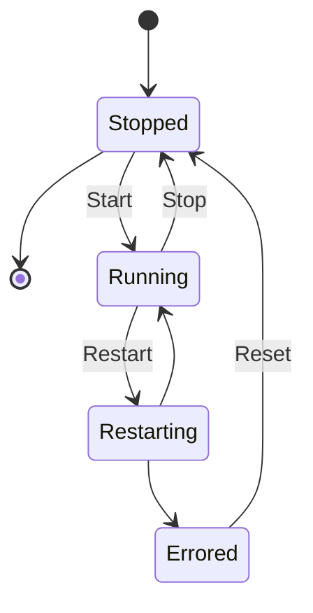

# Svctl

## States

```mermaid
stateDiagram-v2
    [*] --> Stopped
    Stopped --> [*]
    Stopped --> Running: Start
    Running --> Stopped: Stop
    Running --> Restarting: Restart
    Restarting --> Running
    Restarting --> Errored
    Errored --> Stopped: Reset
```
