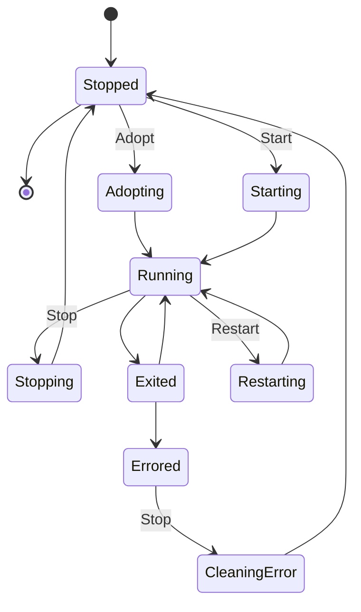

# Svctl

## States

```mermaid
stateDiagram-v2
    [*] --> Stopped
    Stopped --> [*]
    Stopped --> Starting: Start
    Stopped --> Adopting: Adopt
    Adopting --> Running
    Starting --> Running
    Running --> Stopping: Stop
    Stopping --> Stopped
    Running --> Exited
    Running --> Restarting: Restart
    Exited --> Running
    Exited --> Errored
    Errored --> CleaningError: Stop
    CleaningError --> Stopped
    Restarting --> Running
```
